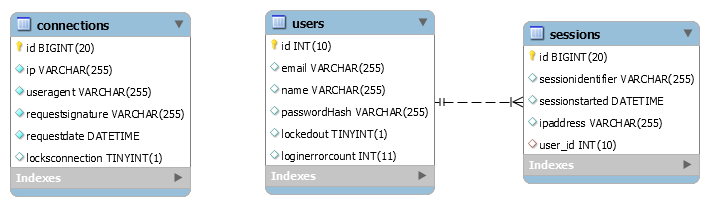

# Medullan Test

## Assumptions
- The library is built to handle secure authentication over web request, can be plugged into **header request** handlers.
- The library is built using CommonJS syntax to maintain backwards compatibility and limit the dependecy requirements, an example using ES6 can be provided upon request.
- No support was added to use process managers for the examples (like pm2), they are built only to provide aditional information on how to use the built functionality and should not be used in a production environment AS IS.
- Every feature was built over TDD practices.
- No http server library was used to adhere to the conditions and assumptions of the Case Exercise, these might have further implementations for http sessions, the statement quotes:
    > Existing or similar implementations of the requirements for this project may exist (depending on your language or framework of choice), however, you are asked to implement the core functionality yourself for the purposes of this exercise. But other tools to support your implementation such as an ORM is OK.
- The actual unit tests were built over the real data and database (for simplicity's sake in the code), an example extending TDD using stubs and sandboxes can be provided upon request.
- Although the functionality to create users is implemented, no functionality is supported on editing or deleting/inactivating user, since these were not in the scope of work.
- No language *i18n* strategies are implemented, these can provided upon request.
- No assumptions are made into securing the database configuration, in production environments these should be setted accordingly to the installation's privacy and security policies.
- The bruteforcing protection can be leveraged within any part of the solution, it's not tied down to the login

## Prerrequisites
- Instalation of MySQL with database creation access
- Node.JS (v.10.X)

## Installation
1. Create a database in MySQL, create an empty database schema and an user with table creation priviledges and data consumption, this database will be used for the data-storage backing and set up the environment
2. Download or clone this repository into your directory of choice
3. Open a terminal or command line according to your OS and point into the project directory
4. Run `npm install` to install all dependencies
5. Run `npm test` to run the unit tests, this process will also create create/update the database

## Run Tests
1. Set connection data to the mysql schema created in step 1, in `test/__initTest.js`
2. Open a terminal or command line according to your OS and point into the project directory
3. Executing the tests over npm should be done as following 
    1. In case a single standalone execution is wanted, call `npm test`
    2. In case a repeated execution is wanted (usful when developing or extending this module), call `npm run test-watch`


## Configuration
The full expected object for the creation of the MyHealthApp authentication module is as follows, configure accordingly to your privacy policies or legislation
```js
{
    database: {
        host: '127.0.0.1',
        user: 'root',
        password: '',
        database: 'myhealthpass'
    },
    password: {
        minlength: 6,
        containsdigit: true,
        containsupper: true,
        containslower: true,
        containsnonalphanumeric: true
    },
    cryptography: {
        asymetrickey: 'asymetric-key',
        symetrickey: 'symetric-key'
    },
    session: {
        expirationseconds: 60 * 10,
        lockoutattempts: 3,
        bruteforcing: {
            minutestocheck: 10,
            minutestolock: 20,
            countrequests: 13
        }
    }
}
```

## Implementation
Only the authority moudle should be used identified like 
```js
const auth = require('./<path to installation>/myhealthpass-auth.js')
```
Note: **all the aditional modules are intended to be used internally and should not be accessed directly as they could generate adverse functionality, only use the exposed from *myhealthpass-auth*** 

### Using the library
```js
var opts = { /* options described in the literal 'configuration' */ }
const auth = require('./<path to installation>/myhealthpass-auth.js')
// Configure the authenticator
/*
The configuration of the authorization library must be only done once in the startup of the application, then the characteristics will be available only by requiring the same library
*/
auth.factory(opts)

// ----- Register new user -----
let response = await auth.users.register({
    email: "",
    name: "",
    password: ""
})
// returns
response = {
    success, // success flag, boolean
    error // errorMessage, string
}

// ----- Query user -----
let response = await getuser(email)
// returns
response = {
    id, // database id
    email,
    name,
    passwordHash,
    lockedout, // if user is logged out due to error count configured
    loginerrorcount // count of mistakes in login
}

// ----- Log in user -----
let response = await auth.users.register({
    email: "",
    password: "",
    ip: "" // client ip
})
// returns
response = {
    success, // success flag, boolean
    error, // errorMessage, string
    token, // secure authentication token to be passed to the cookie or other authentication protocol
    remainingTries, // remainint tries of login before the user gets locked out
}

// ----- Check validity of token -----
let response = await auth.users.sessionValid(token, ip);
// returns simple true or false to lock out the Application

// ----- Extend validity of token on configured seconds -----
let response = await auth.users.sessionExtend(token, ip)
// returns string with the new secure token or null if the passed token is invalid

// ----- DDoS and Bruteforcing protection -----
let response = await auth.users.registerConnection(ip, user_agent, request_signature)
// returns boolean indicating the application should continue serving the request or terminate it, it will continue returning false during the lockout period configured
```


## Database Schema Object Model


The sessions are stored from each login, since it's a healthcare app, all the started sessions will be stored

## Used Libraries and Dependencies
### Production
- A database ORM [knex.js](https://www.npmjs.com/package/knex) was used to simplify the database consumption and provide general schema creator embedded.
- The MySQL driver [mysql](https://www.npmjs.com/package/mysql) needed to connect to the MySQL database
- Node-Extend [extend](https://www.npmjs.com/package/extend) to manage options in the initialization
- Cryptography dependencies
    - Sha256 [js-sha256](https://www.npmjs.com/package/js-sha256) to generate asymetric encryptions
    - SimpleCrypto [simple-crypto-js](https://www.npmjs.com/package/simple-crypto-js) to generate symetric encryptions
- Base64 [base-64](https://www.npmjs.com/package/base-64) to encode encrypted contents as tokens
- Uuid V1 [uuid](https://www.npmjs.com/package/uuid) to generate internal session identifiers
### Development
- Chai contract executor
- Mocha unit test engine